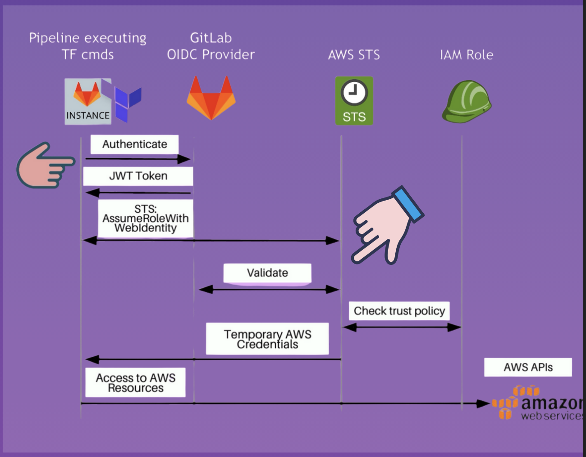

## Establish Trust between GitLab and AWS

In this chapter we created an Identity Provider on AWS. Then a Web Identity role, which has the Trust relationship with the Identity Provider, allowing GitLab to assume the role and interact with AWS resources securely.

- Trust Policy define, which conditions must met to allow other principals to assume the IAM Role
- AWS will recognize that GitLab is an authenticated, authorized identity and allow it to assume the role.

### OIDC Identity Provider

- Allows clients to verify the identity based on the authentication performed by GitLab

**Pre-requisites for "AssumeRoleWithWebIdentity" to work:**
1. Before you app can call AssumeRoleWithWebIdentity, you must have an identity token from a supported identity provider (IdP), such as GitLab.
2. Create a Role that the app can assume
3. The identity provider must be configured in the Role's trust policy.

**Workflow: 1**

1. Authenticate using GitLab's OIDC Provider
   1. We will tell AWS to trust GitLab's OIDC provider
   2. Allows Roles to be assume with tokens issues by the provider
   3. GitLab identity provider will return a JWT token
   4. That token is sent along AWS STS command

2. AWS STS AssumeRoleWithWebIdentity
   1. API provided by STS (Security Token Service)
   2. Returns temporary security credentials for users authenticated by the web identity provider



**Workflow: 2**

1. Access AWS Resources with IAM Role
    1. Use temporary credentials of Role to execute TF commands and create AWS resources

---

Example in the pipeline

```yaml
init:
  id_tokens:
    GITLAB_OIDC_TOKEN:
      aud: https://gitlab.com # Audience for the OIDC token, specified by GitLab OIDC provider configuration and in our AWS trust policy as well
  stage: init
  before_script:
    # Install aws cli
    - apk --no-cache add curl python3 py3-pip
    - pip3 install --no-cache-dir awscli --break-system-packages

    # establish connection with AWS to get access credentials
    # role ARN must be set in the environment variable ROLE_ARN, this is from our AWS Role
    # The credentials will be valid for the duration specified (1 hour in this case)
    # We export the temporary credentials as environment variables for subsequent commands
    - >
      export $(printf "AWS_ACCESS_KEY_ID=%s AWS_SECRET_ACCESS_KEY=%s AWS_SESSION_TOKEN=%s"
      $(aws sts assume-role-with-web-identity
      --role-arn ${ROLE_ARN} 
      --role-session-name "GitLabRunner-${CI_PROJECT_ID}-${CI_PIPELINE_ID}"
      --web-identity-token ${GITLAB_OIDC_TOKEN}
      --duration-seconds 3600
      --query 'Credentials.[AccessKeyId,SecretAccessKey,SessionToken]'
      --output text))
    - aws sts get-caller-identity
  script:
    - terraform init --upgrade
  artifacts:
    paths:
      - .terraform/
      - .terraform.lock.hcl
```